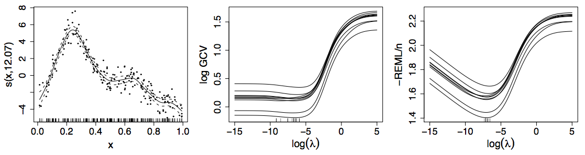

```{r setup, include=FALSE, cache=FALSE}
options(htmltools.dir.version = FALSE)
knitr::opts_chunk$set(cache = TRUE, dev = 'svg', echo = TRUE, message = FALSE, warning = FALSE,
                      fig.height=6, fig.width = 1.777777*6)

library('here')
library('mgcv')
library('gratia')
library('ggplot2')
library('purrr')
library('mvnfast')
library("tibble")
library('gganimate')
library('tidyr')
library("knitr")
library("viridis")
library('readr')
library('dplyr')
library("patchwork")
library("forcats")

## plot defaults
theme_set(theme_minimal(base_size = 16, base_family = 'Fira Sans'))

## constants
anim_width <- 1900
anim_height <- anim_width / 1.77777777
anim_dev <- 'png'
anim_res <- 250
```

# Logistics

* HTML Slide deck [bit.ly/ukraine-gam-slides](https://bit.ly/ukraine-gam-slides) &copy; Simpson (2023) [](http://creativecommons.org/licenses/by/4.0/)
* RMarkdown [bit.ly/ukraine-gam-repo](https://bit.ly/ukraine-gam-repo)
* DOI: [10.5281/zenodo.7825960](https://doi.org/10.5281/zenodo.7825960)

Open RStudio & run

```{r use-course, echo = TRUE, eval = FALSE}
usethis::use_course("https://bit.ly/ukraine-gam")
```

---
class: inverse middle center subsection

# Motivating example

---

# HadCRUT4 time series

```{r hadcrut-temp-example, echo = FALSE}
library("readr")
library("dplyr")
URL <-  "https://bit.ly/hadcrutv4"
gtemp <- read_table(URL, col_types = "nnnnnnnnnnnn", col_names = FALSE) %>%
    select(num_range("X", 1:2)) %>% setNames(nm = c("Year", "Temperature"))

## Plot
gtemp_plt <- ggplot(gtemp, aes(x = Year, y = Temperature)) +
    geom_line() +
    geom_point() +
    labs(x = "Year", y = expression(Temeprature ~ degree * C))
gtemp_plt
```

???

Hadley Centre NH temperature record ensemble

How would you model the trend in these data?

---

# Linear Models

$$y_i \sim \mathcal{N}(\mu_i, \sigma^2)$$

$$\mu_i = \beta_0 + \beta_1 x_{1i} + \beta_2 x_{2i} + \cdots + \beta_j x_{ji}$$

Assumptions

1. linear effects of covariates are good approximation of the true effects
2. conditional on the values of covariates, $y_i | \mathbf{X} \sim \mathcal{N}(0, \sigma^2)$
3. this implies all observations have the same *variance*
4. $y_i | \mathbf{X}$ are *independent*

An **additive** model address the first of these

---
class: inverse center middle subsection

# Why bother with anything more complex?

---

# Is this linear?

```{r hadcrut-temp-example, echo = FALSE}
```

---

# Polynomials perhaps&hellip;

```{r hadcrut-temp-polynomial, echo = FALSE}
p <- c(1,3,8,15)
N <- 300
newd <- with(gtemp, data.frame(Year = seq(min(Year), max(Year), length = N)))
polyFun <- function(i, data = data) {
    lm(Temperature ~ poly(Year, degree = i), data = data)
}
mods <- lapply(p, polyFun, data = gtemp)
pred <- vapply(mods, predict, numeric(N), newdata = newd)
colnames(pred) <- p
newd <- cbind(newd, pred)
polyDat <- gather(newd, Degree, Fitted, - Year)
polyDat <- mutate(polyDat, Degree = ordered(Degree, levels = p))
gtemp_plt + geom_line(data = polyDat, mapping = aes(x = Year, y = Fitted, colour = Degree),
                      size = 1.5, alpha = 0.9) +
    scale_color_brewer(name = "Degree", palette = "PuOr") +
    theme(legend.position = "right")
```

---

# Polynomials perhaps&hellip;

We can keep on adding ever more powers of $\boldsymbol{x}$ to the model &mdash; model selection problem

**Runge phenomenon** &mdash; oscillations at the edges of an interval &mdash; means simply moving to higher-order polynomials doesn't always improve accuracy

---
class: inverse middle center subsection

# GAMs offer a solution

---
class: inverse middle center big-subsection

# Climate example

---

# HadCRUT data set

```{r read-hadcrut, echo = TRUE}
## Load Data
library("readr")
library("dplyr")
URL <-  "https://bit.ly/hadcrutv4"
gtemp <- read_table(URL, col_types = "nnnnnnnnnnnn", col_names = FALSE) %>%
    select(num_range("X", 1:2)) %>% setNames(nm = c("Year", "Temperature"))
```

[File format](https://www.metoffice.gov.uk/hadobs/hadcrut4/data/current/series_format.html)

---

# HadCRUT data set

```{r show-hadcrut, echo = TRUE}
gtemp
```

---

# Fitting a GAM

```{r hadcrutemp-fitted-gam, echo = TRUE, results = 'hide'}
library("mgcv")
m <- gam(Temperature ~ s(Year), data = gtemp, method = "REML")
summary(m)
```

.smaller[
```{r hadcrutemp-fitted-gam, echo = FALSE}
```
]

---

# Fitted GAM

```{r hadcrtemp-plot-gam, echo = FALSE}
N <- 300
newd <- as_tibble(with(gtemp, data.frame(Year = seq(min(Year), max(Year), length = N))))
pred <- as_tibble(as.data.frame(predict(m, newdata = newd, se.fit = TRUE,
                                        unconditional = TRUE)))
pred <- bind_cols(newd, pred) %>%
    mutate(upr = fit + 2 * se.fit, lwr = fit - 2*se.fit)

ggplot(gtemp, aes(x = Year, y = Temperature)) +
    geom_point() +
    geom_ribbon(data = pred,
                mapping = aes(ymin = lwr, ymax = upr, x = Year), alpha = 0.4, inherit.aes = FALSE,
                fill = "#fdb338") +
    geom_line(data = pred,
              mapping = aes(y = fit, x = Year), inherit.aes = FALSE, size = 1, colour = "#025196") +
    labs(x = 'Year', y = expression(Temeprature ~ degree * C))
```

---
class: inverse middle center big-subsection

# GAMs

---

# Generalized Additive Models

<br />


.references[Source: [GAMs in R by Noam Ross](https://noamross.github.io/gams-in-r-course/)]

???

GAMs are an intermediate-complexity model

* can learn from data without needing to be informed by the user
* remain interpretable because we can visualize the fitted features

---

# How is a GAM different?

In LM we model the mean of data as a sum of linear terms:

$$y_i = \beta_0 +\sum_j \color{red}{ \beta_j x_{ji}} + \epsilon_i$$

A GAM is a sum of _smooth functions_ or _smooths_

$$y_i = \beta_0 + \sum_j \color{red}{f_j(x_{ji})} + \epsilon_i$$

where $\epsilon_i \sim N(0, \sigma^2)$, $y_i | \mathbf{X} \sim \text{Normal}$ (for now)

Call the above equation the **linear predictor** in both cases

---

# Fitting a GAM in R

```r
model <- gam(y ~ s(x1) + s(x2) + te(x3, x4), # formula describing model
             data = my_data_frame,           # your data
             method = "REML",                # or "ML"
             family = gaussian)              # or something more exotic
```

`s()` terms are smooths of one or more variables

`te()` terms are the smooth equivalent of *main effects + interactions*

---

# How did `gam()` *know*?

```{r hadcrtemp-plot-gam, echo = FALSE}
```

---
class: inverse
background-image: url('./resources/rob-potter-398564.jpg')
background-size: contain

# What magic is this?

.footnote[
<a style="background-color:black;color:white;text-decoration:none;padding:4px 6px;font-family:-apple-system, BlinkMacSystemFont, &quot;San Francisco&quot;, &quot;Helvetica Neue&quot;, Helvetica, Ubuntu, Roboto, Noto, &quot;Segoe UI&quot;, Arial, sans-serif;font-size:12px;font-weight:bold;line-height:1.2;display:inline-block;border-radius:3px;" href="https://unsplash.com/@robpotter?utm_medium=referral&amp;utm_campaign=photographer-credit&amp;utm_content=creditBadge" target="_blank" rel="noopener noreferrer" title="Download free do whatever you want high-resolution photos from Rob Potter"><span style="display:inline-block;padding:2px 3px;"><svg xmlns="http://www.w3.org/2000/svg" style="height:12px;width:auto;position:relative;vertical-align:middle;top:-1px;fill:white;" viewBox="0 0 32 32"><title></title><path d="M20.8 18.1c0 2.7-2.2 4.8-4.8 4.8s-4.8-2.1-4.8-4.8c0-2.7 2.2-4.8 4.8-4.8 2.7.1 4.8 2.2 4.8 4.8zm11.2-7.4v14.9c0 2.3-1.9 4.3-4.3 4.3h-23.4c-2.4 0-4.3-1.9-4.3-4.3v-15c0-2.3 1.9-4.3 4.3-4.3h3.7l.8-2.3c.4-1.1 1.7-2 2.9-2h8.6c1.2 0 2.5.9 2.9 2l.8 2.4h3.7c2.4 0 4.3 1.9 4.3 4.3zm-8.6 7.5c0-4.1-3.3-7.5-7.5-7.5-4.1 0-7.5 3.4-7.5 7.5s3.3 7.5 7.5 7.5c4.2-.1 7.5-3.4 7.5-7.5z"></path></svg></span><span style="display:inline-block;padding:2px 3px;">Rob Potter</span></a>
]

---
class: inverse
background-image: url('resources/wiggly-things.png')
background-size: contain

???

---

```{r smooth-fun-animation, results = FALSE, echo = FALSE, cache = TRUE}
f <- function(x) {
    x^11 * (10 * (1 - x))^6 + ((10 * (10 * x)^3) * (1 - x)^10)
}

draw_beta <- function(n, k, mu = 1, sigma = 1) {
    rmvn(n = n, mu = rep(mu, k), sigma = diag(rep(sigma, k)))
}

weight_basis <- function(bf, x, n = 1, k, ...) {
    beta <- draw_beta(n = n, k = k, ...)
    out <- sweep(bf, 2L, beta, '*')
    colnames(out) <- paste0('f', seq_along(beta))
    out <- as_tibble(out)
    out <- add_column(out, x = x)
    out <- pivot_longer(out, -x, names_to = 'bf', values_to = 'y')
    out
}

random_bases <- function(bf, x, draws = 10, k, ...) {
    out <- rerun(draws, weight_basis(bf, x = x, k = k, ...))
    out <- bind_rows(out)
    out <- add_column(out, draw = rep(seq_len(draws), each = length(x) * k),
                      .before = 1L)
    class(out) <- c("random_bases", class(out))
    out
}

plot.random_bases <- function(x, facet = FALSE) {
    plt <- ggplot(x, aes(x = x, y = y, colour = bf)) +
        geom_line(lwd = 1, alpha = 0.75) +
        guides(colour = FALSE)
    if (facet) {
        plt + facet_wrap(~ draw)
    }
    plt
}

normalize <- function(x) {
    rx <- range(x)
    z <- (x - rx[1]) / (rx[2] - rx[1])
    z
}

set.seed(1)
N <- 500
data <- tibble(x     = runif(N),
               ytrue = f(x),
               ycent = ytrue - mean(ytrue),
               yobs  = ycent + rnorm(N, sd = 0.5))

k <- 10
knots <- with(data, list(x = seq(min(x), max(x), length = k)))
sm <- smoothCon(s(x, k = k, bs = "cr"), data = data, knots = knots)[[1]]$X
colnames(sm) <- levs <- paste0("f", seq_len(k))
basis <- pivot_longer(cbind(sm, data), -(x:yobs), names_to = 'bf')
basis

set.seed(2)
bfuns <- random_bases(sm, data$x, draws = 20, k = k)

smooth <- bfuns %>%
    group_by(draw, x) %>%
    summarise(spline = sum(y)) %>%
    ungroup()

p1 <- ggplot(smooth) +
    geom_line(data = smooth, aes(x = x, y = spline), lwd = 1.5) +
    labs(y = 'f(x)', x = 'x') +
    theme_minimal(base_size = 14, base_family = 'Fira Sans')

smooth_funs <- animate(
    p1 + transition_states(draw, transition_length = 4, state_length = 2) +
    ease_aes('cubic-in-out'),
    nframes = 200, height = anim_height, width = anim_width, res = anim_res, dev = anim_dev)

anim_save('resources/spline-anim.gif', smooth_funs)
```

# Wiggly things

.center[]

???

GAMs use splines to represent the non-linear relationships between covariates, here `x`, and the response variable on the `y` axis.

---

# Basis expansions

In the polynomial models we used a polynomial basis expansion of $\boldsymbol{x}$

* $\boldsymbol{x}^0 = \boldsymbol{1}$ &mdash; the model constant term
* $\boldsymbol{x}^1 = \boldsymbol{x}$ &mdash; linear term
* $\boldsymbol{x}^2$
* $\boldsymbol{x}^3$
* &hellip;

---

# Splines

Splines are *functions* composed of simpler functions

Simpler functions are *basis functions* & the set of basis functions is a *basis*

When we model using splines, each basis function $b_k$ has a coefficient $\beta_k$

Resultant spline is a the sum of these weighted basis functions, evaluated at the values of $x$

$$f(x) = \sum_{k = 1}^K \beta_k b_k(x)$$

---

# Splines formed from basis functions

```{r basis-functions, fig.height=6, fig.width = 1.777777*6, echo = FALSE}
ggplot(basis,
       aes(x = x, y = value, colour = bf)) +
    geom_line(lwd = 2, alpha = 0.5) +
    guides(colour = FALSE) +
    labs(x = 'x', y = 'b(x)') +
    theme_minimal(base_size = 16, base_family = 'Fira Sans')
```

???

Splines are built up from basis functions

Here I'm showing a cubic regression spline basis with 10 knots/functions

We weight each basis function to get a spline. Here all the basisi functions have the same weight so they would fit a horizontal line

---

# Weight basis functions &#8680; spline

```{r basis-function-animation, results = 'hide', echo = FALSE, cache = TRUE}
bfun_plt <- plot(bfuns) +
    geom_line(data = smooth, aes(x = x, y = spline),
              inherit.aes = FALSE, lwd = 1.5) +
    labs(x = 'x', y = 'f(x)') +
    theme_minimal(base_size = 14, base_family = 'Fira Sans')

bfun_anim <- animate(
    bfun_plt + transition_states(draw, transition_length = 4, state_length = 2) + 
    ease_aes('cubic-in-out'),
    nframes = 200, height = anim_height, width = anim_width, res = anim_res, dev = anim_dev)

anim_save('resources/basis-fun-anim.gif', bfun_anim)
```

.center[]

???

But if we choose different weights we get more wiggly spline

Each of the splines I showed you earlier are all generated from the same basis functions but using different weights

---

# How do GAMs learn from data?

```{r example-data-figure, fig.height=6, fig.width = 1.777777*6, echo = FALSE}
data_plt <- ggplot(data, aes(x = x, y = ycent)) +
    geom_line(col = 'goldenrod', lwd = 2) +
    geom_point(aes(y = yobs), alpha = 0.2, size = 3) +
    labs(x = 'x', y = 'f(x)') +
    theme_minimal(base_size = 16, base_family = 'Fira Sans')
data_plt
```

???

How does this help us learn from data?

Here I'm showing a simulated data set, where the data are drawn from the orange functions, with noise. We want to learn the orange function from the data

---

# Maximise penalised log-likelihood &#8680; &beta;

```{r basis-functions-anim, results = "hide", echo = FALSE, cache = TRUE}
sm2 <- smoothCon(s(x, k = k, bs = "cr"), data = data, knots = knots)[[1]]$X
beta <- coef(lm(ycent ~ sm2 - 1, data = data))
wtbasis <- sweep(sm2, 2L, beta, FUN = "*")
colnames(wtbasis) <- colnames(sm2) <- paste0("F", seq_len(k))
## create stacked unweighted and weighted basis
basis <- as_tibble(rbind(sm2, wtbasis)) %>%
    add_column(x = rep(data$x, times = 2),
               type = rep(c('unweighted', 'weighted'), each = nrow(sm2)),
               .before = 1L)
##data <- cbind(data, fitted = rowSums(scbasis))
wtbasis <- as_tibble(rbind(sm2, wtbasis)) %>%
    add_column(x      = rep(data$x, times = 2),
               fitted = rowSums(.),
               type   = rep(c('unweighted', 'weighted'), each = nrow(sm2))) %>%
    pivot_longer(-(x:type), names_to = 'bf')
basis <- pivot_longer(basis, -(x:type), names_to = 'bf')

p3 <- ggplot(data, aes(x = x, y = ycent)) +
    geom_point(aes(y = yobs), alpha = 0.2) +
    geom_line(data = basis,
              mapping = aes(x = x, y = value, colour = bf),
              lwd = 1, alpha = 0.5) +
    geom_line(data = wtbasis,
              mapping = aes(x = x, y = fitted), lwd = 1, colour = 'black', alpha = 0.75) +
    guides(colour = FALSE) +
    labs(y = 'f(x)', x = 'x') +
    theme_minimal(base_size = 14, base_family = 'Fira Sans')

crs_fit <- animate(p3 + transition_states(type, transition_length = 4, state_length = 2) + 
                   ease_aes('cubic-in-out'),
                   nframes = 100, height = anim_height, width = anim_width, res = anim_res,
                   dev = anim_dev)

anim_save('./resources/gam-crs-animation.gif', crs_fit)
```

.center[]

???

Fitting a GAM involves finding the weights for the basis functions that produce a spline that fits the data best, subject to some constraints


---
class: inverse middle center subsection

# Avoid overfitting our sample

---
class: inverse center middle large-subsection

# How wiggly?

$$
\int_{\mathbb{R}} [f^{\prime\prime}]^2 dx = \boldsymbol{\beta}^{\mathsf{T}}\mathbf{S}\boldsymbol{\beta}
$$

---
class: inverse center middle large-subsection

# Penalised fit

$$
\mathcal{L}_p(\boldsymbol{\beta}) = \mathcal{L}(\boldsymbol{\beta}) - \frac{1}{2} \lambda\boldsymbol{\beta}^{\mathsf{T}}\mathbf{S}\boldsymbol{\beta}
$$

---

# Wiggliness

$$\int_{\mathbb{R}} [f^{\prime\prime}]^2 dx = \boldsymbol{\beta}^{\mathsf{T}}\mathbf{S}\boldsymbol{\beta} = \large{W}$$

(Wiggliness is 100% the right mathy word)

We penalize wiggliness to avoid overfitting

---

# Making wiggliness matter

$W$ measures **wiggliness**

(log) likelihood measures closeness to the data

We use a **smoothing parameter** $\lambda$ to define the trade-off, to find
the spline coefficients $B_k$ that maximize the **penalized** log-likelihood

$$\mathcal{L}_p = \log(\text{Likelihood})  - \lambda W$$

---

# HadCRUT4 time series

```{r hadcrut-temp-penalty, echo = FALSE}
K <- 40
lambda <- c(10000, 1, 0.01, 0.00001)
N <- 300
newd <- with(gtemp, data.frame(Year = seq(min(Year), max(Year), length = N)))
fits <- lapply(lambda, function(lambda) gam(Temperature ~ s(Year, k = K, sp = lambda), data = gtemp))
pred <- vapply(fits, predict, numeric(N), newdata = newd)
op <- options(scipen = 100)
colnames(pred) <- lambda
newd <- cbind(newd, pred)
lambdaDat <- gather(newd, Lambda, Fitted, - Year)
lambdaDat <- transform(lambdaDat, Lambda = factor(paste("lambda ==", as.character(Lambda)),
                                                  levels = paste("lambda ==", as.character(lambda))))

gtemp_plt + geom_line(data = lambdaDat, mapping = aes(x = Year, y = Fitted, group = Lambda),
                      size = 1, colour = "#e66101") +
    facet_wrap( ~ Lambda, ncol = 2, labeller = label_parsed)
options(op)
```

---

# Picking the right wiggliness

.pull-left[
Two ways to think about how to optimize $\lambda$:

* Predictive: Minimize out-of-sample error
* Bayesian:  Put priors on our basis coefficients
]

.pull-right[
Many methods: AIC, Mallow's $C_p$, GCV, ML, REML

* **Practically**, use **REML**, because of numerical stability
* Hence `gam(..., method = "REML")`
]

.center[

]

---

# Maximum allowed wiggliness

We set **basis complexity** or "size" $k$

This is _maximum wigglyness_, can be thought of as number of small functions that make up a curve

Once smoothing is applied, curves have fewer **effective degrees of freedom (EDF)**

EDF < $k$

---

# Maximum allowed wiggliness

$k$ must be *large enough*, the $\lambda$ penalty does the rest

*Large enough* &mdash; space of functions representable by the basis includes the true function or a close approximation to the true function

Bigger $k$ increases computational cost

In **mgcv**, default $k$ values are arbitrary &mdash; after choosing the model terms, this is the key user choice

**Must be checked!** &mdash; `gam.check()`


---

# GAM summary so far

1. GAMs give us a framework to model  flexible nonlinear relationships

2. Use little functions (**basis functions**) to make big functions (**smooths**)

3. Use a **penalty** to trade off wiggliness/generality 

4. Need to make sure your smooths are **wiggly enough**

---
class: inverse middle center subsection

# Ozone example

---
class: inverse middle center subsection

# A cornucopia of smooths

---

# A cornucopia of smooths

The type of smoother is controlled by the `bs` argument (think *basis*)

The default is a low-rank thin plate spline `bs = 'tp'`

Many others available

.small[
.row[
.col-6[

* Cubic splines `bs = 'cr'`
* P splines `bs = 'ps'`
* Cyclic splines `bs = 'cc'` or `bs = 'cp'`
* Adaptive splines `bs = 'ad'`
* Random effect `bs = 're'`
* Factor smooths `bs = 'fs'`
]
.col-6[

* Duchon splines `bs = 'ds'`
* Spline on the sphere `bs = 'sos'`
* MRFs `bs = 'mrf'`
* Soap-film smooth `bs = 'so'`
* Gaussian process `bs = 'gp'`
* Constrained factor smooth `bs = 'sz'`
]
]
]

---

# A bestiary of conditional distributions

A GAM is just a fancy GLM

Simon Wood & colleagues (2016) have extended the *mgcv* methods to some non-exponential family distributions


.row[
.col-5[
* `binomial()`
* `poisson()`
* `Gamma()`
* `inverse.gaussian()`
* `nb()`
* `tw()`
* `mvn()`
]
.col-4[
* `multinom()`
* `betar()`
* `scat()`
* `gaulss()`
* `ziplss()`
* `twlss()`
* `cox.ph()`
]
.col-3[
* `gevlss()`
* `gamals()`
* `ocat()`
* `shash()`
* `gumbls()`
* `cnorm()`
* `ziP()`
]
]

---

# The whole process 1

```{r whole-basis-proces, echo = FALSE, fig.height = 4, fig.width = 1.777777 * 6}
K <- 13
df <- data.frame(x = seq(0, 1, length = 200))
knots <- data.frame(x = seq(0, 1, length.out = 11))
bs <- basis(s(x, bs = "ps", k = K), data = df,
    knots = list(x = seq(-3, 13) / 10))

# let's weight the basis functions (simulating model coefs)
set.seed(1)
betas <- data.frame(bf = factor(seq_len(K)), beta = rnorm(K))

unwtd_bs_plt <- bs |>
    draw() +
    geom_vline(aes(xintercept = x), data = knots, linetype = "dotted",
        alpha = 0.5)

# we need to merge the weights for each basis function with the basis object
bs <- bs |>
    left_join(betas, by = join_by("bf" == "bf")) |>
    mutate(value_w = value * beta)

# weighted basis
wtd_bs_plt <- bs |>
    ggplot(aes(x = x, y = value_w, colour = bf, group = bf)) +
    geom_line(show.legend = FALSE) +
    geom_vline(aes(xintercept = x), data = knots, linetype = "dotted",
        alpha = 0.5) +
    labs(y = expression(f(x)), x = "x")

# now we want to sum the weighted basis functions for each value of `x`
spl <- bs |>
    group_by(x) |>
    summarise(spline = sum(value_w))

take <- c(83, 115)
pts <- bs |>
    group_by(bf) |>
    slice(take)

# now plot
bs_plt <- bs |>
    ggplot(aes(x = x, y = value_w, colour = bf, group = bf)) +
    geom_line(show.legend = FALSE) +
    geom_line(aes(x = x, y = spline), data = spl, linewidth = 1.25,
              inherit.aes = FALSE) +
    geom_vline(aes(xintercept = x), data = knots, linetype = "dotted",
        alpha = 0.5) +
    geom_vline(xintercept = c(df$x[take]), linetype = "dashed",
        alpha = 1) +
    geom_point(data = pts, aes(x = x, y = value_w, colour = bf, group = bf),
        size = 2, show.legend = FALSE) +
    geom_point(data = slice(spl, take), aes(x = x, y = spline),
        size = 3, colour = "red", inherit.aes = FALSE) +
    labs(y = expression(f(x)), x = "x")

unwtd_bs_plt + wtd_bs_plt + bs_plt + plot_layout(ncol = 3)
```

---

# The whole process 2

```{r whole-basis-proces-2-model}
dat <- data_sim("eg1", seed = 4)
m <- gam(y ~ s(x0) + s(x1) + s(x2, bs = "bs") + s(x3),
         data = dat, method = "REML")
```

```{r whole-basis-proces-2-model-draw, fig.height = 5, fig.width = 1.777777 * 6}
draw(m) + plot_layout(ncol = 4)
```

---

# The whole process 3

```{r whole-basis-proces-2, echo = FALSE, fig.height = 6, fig.width = 1.777777 * 6}
# data to evaluate the basis at
# using the CRAN version of {gratia}, we need `m`
ds <- data_slice(m, x2 = evenly(x2, n = 200))
# from 0.9.0 (or current GitHub version) you can do
# ds <- data_slice(dat, x2 = evenly(x2, n = 200))

# generate a tidy representation of the fitted basis functions
x2_bs <- basis(m, term = "s(x2)", data = ds)

# compute values of the spline by summing basis functions at each x2
x2_spl <- x2_bs |>
    group_by(x2) |>
    summarise(spline = sum(value))

# evaluate the spline at the same values as we evaluated the basis functions
x2_sm <- smooth_estimates(m, "s(x2)", data = ds) |>
    add_confint()

take <- c(65, 175)
pts <- x2_bs |>
    group_by(bf) |>
    slice(take)

# now plot
x2_bs |>
    ggplot(aes(x = x2, y = value, colour = bf, group = bf)) +
    geom_line(show.legend = FALSE) +
    geom_ribbon(aes(x = x2, ymin = lower_ci, ymax = upper_ci),
                data = x2_sm,
                inherit.aes = FALSE, alpha = 0.2) +
    geom_line(aes(x = x2, y = est), data = x2_sm,
              linewidth = 1.5, inherit.aes = FALSE) +
    geom_vline(xintercept = c(ds$x2[take]), linetype = "dashed",
        alpha = 1) +
    geom_point(data = pts, aes(x = x2, y = value, colour = bf, group = bf),
        size = 2, show.legend = FALSE) +
    geom_point(data = slice(x2_sm, take), aes(x = x2, y = est),
        size = 3, colour = "red", inherit.aes = FALSE) +
    labs(y = expression(f(x2)), x = "x2")
```

---
class: inverse middle center big-subsection

# Interactions

---

# Smooth interactions

Two ways to fit smooth interactions

1. Bivariate (or higher order) thin plate splines
    * `s(x, z, bs = 'tp')`
    * Isotropic; single smoothness parameter for the smooth
	* Sensitive to scales of `x` and `z`
2. Tensor product smooths
    * Separate marginal basis for each smooth, separate smoothness parameters
	* Invariant to scales of `x` and `z`
	* Use for interactions when variables are in different units
	* `te(x, z)`

---

# Smooth interactions

```{r tprs-vs-tensor-product-setup, echo = FALSE}
# following shows how tensor pruduct deals nicely with 
# badly scaled covariates (range of x 5% of range of z )
test1 <- function(x, z, sx = 0.3, sz = 0.4) {
  x <- x * 20
  (pi ** sx * sz) * (1.2 * exp(-(x - 0.2)^2 / sx^2 - (z - 0.3)^2 / sz^2) +
    0.8 * exp(-(x - 0.7)^2 / sx^2 - ( z - 0.8)^2 / sz^2))
}
n <- 500
x <- runif(n) / 20
z <- runif(n)
xs <- seq(0, 1, length = 30) / 20
zs <- seq(0, 1, length = 30)
pr <- tibble(x = rep(xs, 30), z = rep(zs, rep(30, 30)))
truth <- matrix(test1(pr$x, pr$z), 30, 30)
f <- test1(x, z)
y <- f + rnorm(n) * 0.2
df <- tibble(y = y, x = x, z = z)
truth_df <- pr %>% mutate(f = test1(x, z))
m_tprs <- gam(y ~ s(x, z), data = df, method = "REML")
m_te <- gam(y ~ te(x, z), data = df, method = "REML")

truth_plt <- truth_df %>%
  ggplot(aes(x = x, y = z, fill = f)) +
    geom_raster() +
    scale_fill_distiller(palette = "RdBu", type = "div") +
    geom_contour(aes(z = f), colour = "black", bins = 8) +
    labs(title = "f(x,z)")
```

```{r draw-tprs-vs-tensor-product-truth, echo = FALSE}
old_par <- par(mar = c(0, 2, 0, 0), bg = NA)
truth_plt +
  wrap_elements(panel = ~ persp(xs, zs, truth), clip = FALSE) +
  plot_layout(ncol = 2)
par(old_par)
```

---

# Smooth interactions

```{r tprs-vs-tensor-product}
df
m_tprs <- gam(y ~ s(x, z), data = df, method = "REML")
m_te   <- gam(y ~ te(x, z), data = df, method = "REML")
```

---

# Smooth interactions

```{r draw-tprs-vs-tensor-product, message = FALSE, out.width = "95%"}
truth_plt + (draw(m_tprs) + coord_cartesian()) + draw(m_te) + plot_layout(ncol = 3)
```

---

# Smooth interactions

```{r plot-tprs-vs-tensor-product-fake, eval = FALSE}
layout(matrix(1:3, ncol = 3))
persp(xs, zs, truth)
vis.gam(m_tprs)
vis.gam(m_te)
layout(1)
```

```{r plot-tprs-vs-tensor-product, echo = FALSE, fig.width = 6, fig.width = 18}
old_par <- par(mar = c(0, 2, 0, 0), bg = NA)
persp1 <- wrap_elements(panel = ~ persp(xs, zs, truth), clip = FALSE)
persp2 <- wrap_elements(panel = ~ vis.gam(m_tprs), clip = FALSE)
persp3 <- wrap_elements(panel = ~ vis.gam(m_te), clip = FALSE)
plt <- persp1 + labs(title = "Truth") + 
  persp2 + labs(title = "TPRS") +
  persp3 + labs(title = "Tensor Product") +
  plot_layout(ncol = 3)
plt
par(old_par)
```

---

# Tensor product smooths

There are multiple ways to build tensor products in *mgcv*

1. `te(x, z)`
2. `t2(x, z)`
3. `s(x) + s(z) + ti(x, z)`

`te()` is the most general form but not usable in `gamm4::gamm4()` or *brms*

`t2()` is an alternative implementation that does work in `gamm4::gamm4()` or *brms*

`ti()` fits pure smooth interactions; where the main effects of `x` and `z` have been removed from the basis

---

# Tensor product smooths

.center[
```{r echo = FALSE, out.width = "50%"}
knitr::include_graphics("resources/wood-gams-2ed-fig-5-17-tensor-product.svg")
```
]

---

# Factor smooth interactions I

Several ways to include factor smooth interactions

1. `by` variable smooths
    * entirely separate smooth function for each level of the factor
	* each has it's own smoothness parameter
	* centred (no group means) so include factor as a fixed effect
	* `y ~ f + s(x, by = f)`
2. `by` variable smooths *ordered* variant
    * main smooth for reference level
	* smooth deviation from reference for other levels
	* each smooth has it's own smoothness parameter
	* `y ~ o + s(x) + s(x, by = o)`

---

# Factor smooth interactions II

Several ways to include factor smooth interactions

3. `bs = 'fs'` basis
    * smooth function for each level of the function
	* share a common smoothness parameter
	* fully penalized; include group means
	* closer to random effects
	* `y ~ s(x, f, bs = 'fs')`
3. `bs = 'sz'` basis (**New**)
    * provides orthogonal smooth differences from main effect
	* share a common smoothness parameter
	* include group means
	* `y ~ s(x) + s(x, f, bs = 'sz')`

---

# Random effects

When fitted with REML or ML, smooths can be viewed as just fancy random effects

Inverse is true too; random effects can be viewed as smooths

If you have simple random effects you can fit those in `gam()` and `bam()` without needing the more complex GAMM functions `gamm()` or `gamm4::gamm4()`

These two models are equivalent

```{r ranefs}
m_nlme <- lme(travel ~ 1, data = Rail, ~ 1 | Rail, method = "REML") 

m_gam  <- gam(travel ~ s(Rail, bs = "re"), data = Rail, method = "REML")
```

---

# Random effects

The random effect basis `bs = 're'` is not as computationally efficient as *nlme* or *lme4* for fitting

* complex random effects terms, or
* random effects with many levels

Instead see `gamm()` and `gamm4::gamm4()`

* `gamm()` fits using `lme()`
* `gamm4::gamm4()` fits using `lmer()` or `glmer()`

For non Gaussian models use `gamm4::gamm4()`

---
class: inverse middle center big-subsection

# gratia 📦

---

# gratia 📦

{gratia} is a package for working with GAMs

Mostly limited to GAMs fitted with {mgcv} & {gamm4}

Follows (sort of) Tidyverse principles

* return tibbles (data frames)

* suitable for plotting with {ggplot2}

* graphics use {ggplot2} and {patchwork}

---
class: inverse center middle subsection

# Model checking

---

# Model checking

So you have a GAM:

- How do you know you have the right degrees of freedom? `gam.check()`

- Diagnosing model issues: `gam.check()` part 2

---

# GAMs are models too

How accurate your predictions depends on how good the model is

```{r misspecify, echo = FALSE, out.width = "95%"}
set.seed(15)
model_list = c("right model",
               "wrong distribution",
               "heteroskedasticity",
               "dependent data",
               "wrong functional form")
n <- 60
sigma=1
x <- seq(-1,1, length=n)
model_data <- as.data.frame(expand.grid( x=x,model=model_list))
model_data$y <- 5*model_data$x^2 + 2*model_data$x
for(i in model_list){
  if(i == "right model"){
    model_data[model_data$model==i, "y"] <- model_data[model_data$model==i, "y"]+ 
      rnorm(n,0, sigma)
  } else if(i == "wrong distribution"){
    model_data[model_data$model==i, "y"] <- model_data[model_data$model==i, "y"]+ 
      rt(n,df = 3)*sigma
  } else if(i == "heteroskedasticity"){
    model_data[model_data$model==i, "y"] <- model_data[model_data$model==i, "y"]+  
      rnorm(n,0, sigma*10^(model_data[model_data$model==i, "x"]))
  } else if(i == "dependent data"){
    model_data[model_data$model==i, "y"] <- model_data[model_data$model==i, "y"]+ 
      arima.sim(model = list(ar=c(.7)), n = n,sd=sigma) 
  } else if(i=="wrong functional form") {
    model_data[model_data$model==i, "y"] <- model_data[model_data$model==i, "y"]+ 
      rnorm(n,0, sigma) + ifelse(model_data[model_data$model==i, "x"]>0, 5,-5)
  }
}
ggplot(aes(x,y), data= model_data)+
  geom_point()+
  geom_line(color=ifelse(model_data$model=="dependent data", "black",NA))+
  facet_wrap(~model)+
  geom_smooth(method=gam, formula = y~s(x,k=12),method.args = list(method="REML"))+
  theme(strip.text = element_text(size=16))
```

---
class: inverse center middle subsection

# How do we test how well our model fits?

---

# Simulated data

`y` varies sinusoidally with `x1`

`y` varies sigmoidally with `x2`

Simulate response data from Gaussian, negative binomial, & binomial distributions
```{r sims, include=TRUE,echo=TRUE}
set.seed(2)
n <- 400
x1 <- rnorm(n)
x2 <- rnorm(n)
y_val <- 1 + 2*cos(pi*x1) + 2/(1+exp(-5*(x2)))
y_norm <- y_val + rnorm(n, 0, 0.5)
y_negbinom <- rnbinom(n, mu = exp(y_val),size=10)
y_binom <- rbinom(n,1,prob = exp(y_val)/(1+exp(y_val)))
```

---

# Simulated data

```{r sims_plot,fig.width = 11, fig.height = 5.5, echo = FALSE}
p1 <- ggplot(data.frame(x = x1, y = y_norm),
             aes(x = x, y = y)) +
    geom_point() + labs(x = "x1", title = "Gaussian")

p2 <- ggplot(data.frame(x = x2, y = y_norm),
             aes(x = x, y = y)) +
    geom_point() + labs(x = "x2", title = "Gaussian")

p3 <- ggplot(data.frame(x = x1, y = y_negbinom),
             aes(x = x, y = y)) +
    geom_point() + labs(x = "x1", title = "Negative binomial")

p4 <- ggplot(data.frame(x = x2, y = y_negbinom),
             aes(x = x, y = y)) +
    geom_point() + labs(x = "x2", title = "Negative binomial")

p5 <- ggplot(data.frame(x = x1, y = y_binom),
             aes(x = x, y = y)) +
    geom_point() + labs(x = "x1", title = "Binomial")

p6 <- ggplot(data.frame(x = x2, y = y_binom),
             aes(x = x, y = y)) +
    geom_point() + labs(x = "x2", title = "Binomial")

#plot_grid(p1, p3, p5, p2, p4, p6, ncol = 3, align = 'hv', axis = 'lrtb')
wrap_plots(p1, p3, p5, p2, p4, p6, ncol = 3)
```

---
class: inverse middle center subsection

# gam.check() part 1: do you have the right functional form?

---

# How well does the model fit?

- Many choices: k, family, type of smoother, &hellip;

- How do we assess how well our model fits?

---

# Basis size *k*

- Set `k` per term

- e.g. `s(x, k=10)` or `s(x, y, k=100)`

- Penalty removes "extra" wigglyness
    
	- *up to a point!*

- (But computation is slower with bigger `k`)

---

# Checking basis size

```{r gam_check_norm1, fig.keep="none", include=TRUE,echo=TRUE, fig.width=11, fig.height = 5.5, fig.align="center"}
norm_model_1 <- gam(y_norm ~ s(x1, k = 4) + s(x2, k = 4), method = 'REML')
gam.check(norm_model_1)
```

---

# Checking basis size

```{r gam_check_norm2, fig.keep="none", include=TRUE, echo=TRUE, fig.width=15, fig.height = 5.5,fig.align="center"}
norm_model_2 <- gam(y_norm ~ s(x1, k = 12) + s(x2, k = 4), method = 'REML')
gam.check(norm_model_2)
```

---

# Checking basis size

```{r gam_check_norm3, fig.keep="none", include=TRUE, echo=TRUE}
norm_model_3 <- gam(y_norm ~ s(x1, k = 12) + s(x2, k = 12),method = 'REML')
gam.check(norm_model_3)
```

---

# Checking basis size

```{r gam_check_norm4, echo = FALSE}
thm <- theme_bw(base_size = 12, base_family = 'Fira Sans')
p1 <- draw(norm_model_1) & thm
p2 <- draw(norm_model_2) & thm
p3 <- draw(norm_model_3) & thm

## plot_grid(p1, p2, p3, nrow = 3, align = 'hv', axis = 'lrtb')
wrap_plots(p1, p2, p3, nrow = 3)
```

---

# Checking basis size

Two common ways that the `k.check()` (`gam.check()`) test will reject the null hypothesis of adequate basis size

1. Unmodelled auto-correlation

2. Incorrectly specified mean-variance relationship (wrong `family`)

---

# Checking basis size (alt)

Model with `k` set to be too low for each smooth

```{r alt-basis-dim-check-1}
norm_model_1 <- gam(y_norm ~ s(x1, k = 4) + s(x2, k = 4), method = "REML")
k.check(norm_model_1)
```

Alternate way of assessing if the basis size is sufficient is to take the deviance residuals from the model and fit a GAM to those with `family = quasi(link = "identity", variance = "constant")` and `k` doubled

???

Remember we had this model where we had set `k` to be too low for each of the two smooths

---

# Checking basis size (alt)

```{r alt-basis-dim-check-2}
res <- resid(norm_model_1, type = "deviance")

res_model <- gam(res ~ s(x1, k = 12) + s(x2, k = 12),
  method = "REML",
  family = quasi(link = "identity", variance = "constant"))
edf(res_model)
```

---

# Checking basis size (alt)
```{r alt-basis-dim-check-3, fig.align = "center", out.width = "95%"}
draw(res_model)
```

---
class: inverse middle center subsection

# Model diagnostics

---
class: inverse middle center subsection

# Using gam.check() part 2: visual checks

---

# gam.check() plots

`gam.check()` creates 4 plots: 

1. Quantile-quantile plots of residuals. If the model is right, should follow 1-1 line

2. Histogram of residuals

3. Residuals vs. linear predictor

4. Observed vs. fitted values

`gam.check()` uses deviance residuals by default

---

# Gaussian data, Gaussian model

```{r gam_check_plots1, include=TRUE, echo=TRUE, results="hide", out.width = "90%", fig.align = "center"}
norm_model <- gam(y_norm ~ s(x1, k=12) + s(x2, k=12), method="REML")
gam.check(norm_model, rep = 500)
```

---

# Negative binomial data, Poisson model

```{r gam_check_plots2, include=T, echo=TRUE, results="hide", out.width = "90%", fig.align = "center"}
pois_model <- gam(y_negbinom ~ s(x1, k=12) + s(x2, k=12), family=poisson, method="REML")
gam.check(pois_model, rep = 500)
```

---

# NegBin data, NegBin model

```{r gam_check_plots3, include=T,echo=TRUE, results="hide", out.width = "90%", fig.align = "center"}
negbin_model <- gam(y_negbinom ~ s(x1, k=12) + s(x2, k=12), family = nb, method="REML")
gam.check(negbin_model, rep = 500)
```

---

# NegBin data, NegBin model

```{r appraise-gam-check-example, fig.height = 5.5}
appraise(negbin_model, method = 'simulate')
```

---
class: inverse middle center subsection

# Example

---

# Galveston Bay

.row[

.col-6[
Cross Validated question

> I have a dataset of water temperature measurements taken from a large waterbody at irregular intervals over a period of decades. (Galveston Bay, TX if you’re interested)

<https://stats.stackexchange.com/q/244042/1390>

]

.col-6[

.center[
```{r cross-validated, echo = FALSE}

```
]

]
]

---

# Galveston Bay

.small[
```{r load-galveston}
galveston <- read_csv("https://bit.ly/gam-galveston") %>%
    mutate(datetime = as.POSIXct(paste(DATE, TIME),
                                 format = '%m/%d/%y %H:%M', tz = "CDT"),
           STATION_ID = factor(STATION_ID),
           DoY = as.numeric(format(datetime, format = '%j')),
           ToD = as.numeric(format(datetime, format = '%H')) +
               (as.numeric(format(datetime, format = '%M')) / 60))
galveston
```
]

---

# Galveston Bay model description

$$
\begin{align}
  \begin{split}
      \mathrm{E}(y_i) & = \alpha + f_1(\text{ToD}_i) + f_2(\text{DoY}_i) + f_3(\text{Year}_i) + f_4(\text{x}_i, \text{y}_i) + \\
        & \quad f_5(\text{DoY}_i, \text{Year}_i) + f_6(\text{x}_i, \text{y}_i, \text{ToD}_i) + \\
        & \quad f_7(\text{x}_i, \text{y}_i, \text{DoY}_i) + f_8(\text{x}_i, \text{y}_i, \text{Year}_i)
  \end{split}
\end{align}
$$

* $\alpha$ is the model intercept,
* $f_1(\text{ToD}_i)$ is a smooth function of time of day,
* $f_2(\text{DoY}_i)$ is a smooth function of day of year ,
* $f_3(\text{Year}_i)$ is a smooth function of year,
* $f_4(\text{x}_i, \text{y}_i)$ is a 2D smooth of longitude and latitude,

---

# Galveston Bay model description

$$
\begin{align}
  \begin{split}
      \mathrm{E}(y_i) & = \alpha + f_1(\text{ToD}_i) + f_2(\text{DoY}_i) + f_3(\text{Year}_i) + f_4(\text{x}_i, \text{y}_i) + \\
        & \quad f_5(\text{DoY}_i, \text{Year}_i) + f_6(\text{x}_i, \text{y}_i, \text{ToD}_i) + \\
        & \quad f_7(\text{x}_i, \text{y}_i, \text{DoY}_i) + f_8(\text{x}_i, \text{y}_i, \text{Year}_i)
  \end{split}
\end{align}
$$

* $f_5(\text{DoY}_i, \text{Year}_i)$ is a tensor product smooth of day of year and year,
* $f_6(\text{x}_i, \text{y}_i, \text{ToD}_i)$ tensor product smooth of location & time of day
* $f_7(\text{x}_i, \text{y}_i, \text{DoY}_i)$ tensor product smooth of location day of year& 
* $f_8(\text{x}_i, \text{y}_i, \text{Year}_i$ tensor product smooth of location & year

---

# Galveston Bay model description

$$
\begin{align}
  \begin{split}
      \mathrm{E}(y_i) & = \alpha + f_1(\text{ToD}_i) + f_2(\text{DoY}_i) + f_3(\text{Year}_i) + f_4(\text{x}_i, \text{y}_i) + \\
        & \quad f_5(\text{DoY}_i, \text{Year}_i) + f_6(\text{x}_i, \text{y}_i, \text{ToD}_i) + \\
        & \quad f_7(\text{x}_i, \text{y}_i, \text{DoY}_i) + f_8(\text{x}_i, \text{y}_i, \text{Year}_i)
  \end{split}
\end{align}
$$

Effectively, the first four smooths are the main effects of

1. time of day,
2. season,
3. long-term trend,
4. spatial variation

---

# Galveston Bay model description

$$
\begin{align}
  \begin{split}
      \mathrm{E}(y_i) & = \alpha + f_1(\text{ToD}_i) + f_2(\text{DoY}_i) + f_3(\text{Year}_i) + f_4(\text{x}_i, \text{y}_i) + \\
        & \quad f_5(\text{DoY}_i, \text{Year}_i) + f_6(\text{x}_i, \text{y}_i, \text{ToD}_i) + \\
        & \quad f_7(\text{x}_i, \text{y}_i, \text{DoY}_i) + f_8(\text{x}_i, \text{y}_i, \text{Year}_i)
  \end{split}
\end{align}
$$

whilst the remaining tensor product smooths model smooth interactions between the stated covariates, which model

5. how the seasonal pattern of temperature varies over time,
6. how the time of day effect varies spatially,
7. how the seasonal effect varies spatially, and
8. how the long-term trend varies spatially

---

# Galveston Bay &mdash; full model

```{r galveston-full-model}
knots <- list(DoY = c(0.5, 366.5))
m <- bam(MEASUREMENT ~
             s(ToD, k = 10) +
             s(DoY, k = 12, bs = "cc") +
             s(YEAR, k = 30) +
             s(LONGITUDE, LATITUDE, k = 100, bs = "ds", m = c(1, 0.5)) +
             ti(DoY, YEAR, bs = c("cc", "tp"), k = c(12, 15)) +
             ti(LONGITUDE, LATITUDE, ToD, d = c(2,1), bs = c("ds", "tp"),
                m = list(c(1, 0.5), NA), k = c(20, 10)) +
             ti(LONGITUDE, LATITUDE, DoY, d = c(2,1), bs = c("ds", "cc"),
                m = list(c(1, 0.5), NA), k = c(25, 12)) +
             ti(LONGITUDE, LATITUDE, YEAR, d = c(2,1), bs = c("ds", "tp"),
                m = list(c(1, 0.5), NA), k = c(25, 15)),
         data = galveston, method = "fREML", knots = knots,
         nthreads = c(6, 1), discrete = FALSE)
```

---

# Galveston Bay &mdash; simpler model

```{r galveston-simple-model}
m.sub <- bam(MEASUREMENT ~
             s(ToD, k = 10) +
             s(DoY, k = 12, bs = "cc") +
             s(YEAR, k = 30) +
             s(LONGITUDE, LATITUDE, k = 100, bs = "ds", m = c(1, 0.5)) +
             ti(DoY, YEAR, bs = c("cc", "tp"), k = c(12, 15)),
         data = galveston, method = "fREML", knots = knots,
         nthreads = c(4, 1), discrete = TRUE)
```

---

# Galveston Bay &mdash; simpler model?

```{r galveston-compare-models-aic}
AIC(m, m.sub)
```
---

# Galveston Bay &mdash; simpler model?

.smaller[
```{r galveston-compare-models-anova}
anova(m, m.sub, test = "F")
```
]

---

# Galveston Bay &mdash; full model summary

.small[
```{r galveston-full-model-summary}
summary(m)
```
]

---

# Galveston Bay &mdash; full model plot

```{r galveston-full-model-plot, fig.height = 5.5}
plot(m, pages = 1, scheme = 2, shade = TRUE)
```

---

# Galveston Bay &mdash; full model plot

```{r galveston-full-model-draw, fig.height = 14, fig.width = 1.777777*14, fig.align = "center", out.width = "90%"}
draw(m, scales = "free", rug = FALSE, n = 50) +  plot_layout(widths = 1) &
  theme(strip.text.x = element_text(size = 8))
```

---

# Galveston Bay &mdash; predict

```{r galveston-full-predict}
pdata <- data_slice(m, ToD = 12, DoY = 180,
                    YEAR = evenly(YEAR, by = 1),
                    LONGITUDE = evenly(LONGITUDE, n = 50),
                    LATITUDE  = evenly(LATITUDE, n = 50))
fv <- fitted_values(m, data = pdata)
# set fitted values to NA for grid points that are too far from the data
ind <- too_far(pdata$LONGITUDE, pdata$LATITUDE,
               galveston$LONGITUDE, galveston$LATITUDE, dist = 0.1)
fv <- fv %>%
  mutate(fitted = if_else(ind, NA_real_, fitted))
```

---

# Galveston Bay &mdash; plot

```{r galveston-full-predict-plot, fig.show = 'hide', fig.height = 10, fig.width = 1.777777*10}
plt <- ggplot(fv, aes(x = LONGITUDE, y = LATITUDE)) +
    geom_raster(aes(fill = fitted)) + facet_wrap(~ YEAR, ncol = 12) +
    scale_fill_viridis(name = expression(degree*C), option = "plasma",
      na.value = "transparent") +
    coord_quickmap() +
    scale_x_continuous(guide = guide_axis(n.dodge = 2,
                                          check.overlap = TRUE)) +
    theme(legend.position = "top")
plt
```

---

# Galveston Bay &mdash; plot

```{r galveston-full-predict-plot, echo = FALSE, fig.height = 10, fig.width = 1.777777*10}
```

---

# Galveston Bay &mdash;

```{r galveston-animation, echo = FALSE, results = 'hide'}
p <- ggplot(fv, aes(x = LONGITUDE, y = LATITUDE, frame = YEAR)) +
    geom_raster(aes(fill = fitted)) +
    scale_fill_viridis(name = expression(degree*C), option = "plasma",
                       na.value = "transparent") +
    coord_quickmap() +
    theme(legend.position = "right") +
    labs(x = "Longitude", y = "Latitude")

anim <- p + transition_time(YEAR) +
    ggtitle("Year {round(frame_time, 0)}")

anim <- animate(anim,
                nframes = 200, height = anim_height, width = anim_width,
                res = 100, dev = anim_dev)

anim_save('./resources/galveston-animation.gif', anim)
```

.center[]

---

# Galveston Bay &mdash; plot trends

```{r galveston-trends-by-month, fig.show = "hide"}
ds <- data_slice(m, ToD = 12, DoY = c(1, 90, 180, 270),
  YEAR = evenly(YEAR, n = 250),
  LONGITUDE = -94.8751, LATITUDE  = 29.50866)
fv <- fitted_values(m, data = ds, scale = "response")

plt2 <- ggplot(fv, aes(x = YEAR, y = fitted, group = factor(DoY))) +
    geom_ribbon(aes(ymin = lower, ymax = upper), fill = "black", alpha = 0.2) +
    geom_line() + facet_wrap(~ DoY, scales = "free_y") +
    labs(x = NULL, y = expression(Temperature ~ (degree * C)))
plt2
```

---

# Galveston Bay &mdash; plot trends

```{r galveston-trends-by-month, echo = FALSE}
```

---
class: inverse center middle subsection

# Example

---

# Rat hormone experiment

https://bit.ly/rat-hormone

Study on the effects of testosterone on the growth of rats (Molenberghs and Verbeke, 2000)

50 rats randomly assigned to 1 of 3 groups:

1. a control group
2. a group receiving low doses of Decapeptyl
3. a high Decapeptyl dose group

Decapeptyl inhibits the preoduction of testosterone

Experiment started (day 1) when rats were 45 days old and from day 50 the size of each rat's head was measured via an x-ray image

```{r setup-rat-hormone-example, echo = FALSE}
rats_url <- "https://bit.ly/rat-hormone"
rats <- read_table(rats_url, col_types = "dddddddddddd-")
# ignore the warning - it"s due to trailing white space at the ends of each
#   row in the file

rats <- rats %>%
    mutate(treatment = fct_recode(factor(group, levels = c(1, 2, 3)),
                                  Low = "1",
                                  High = "2",
                                  Control = "3"),
           treatment = fct_relevel(treatment, c("Control", "Low", "High")),
           subject = factor(subject))

plt_labs <- labs(y = "Head height (distance in pixels)",
                 x = "Age in days",
                 colour = "Treatment")

rat_plt <- ggplot(rats, aes(x = time, y = response,
                            group = subject, colour = treatment)) +
    geom_line() +
    facet_wrap(~ treatment, ncol = 3) +
    plt_labs
```

???

By way of an example, I'm going to use a data set from a study on the effects of testosterone on the growth of rats from Molenberghs and Verbeke (2000), which was analysed in Fahrmeir et al. (2013), from were I also obtained the data. In the experiment, 50 rats were randomly assigned to one of three groups; a control group or a group receiving low or high doses of Decapeptyl, which inhibits testosterone production. The experiment started when the rats were 45 days old and starting with the 50th day, the size of the rat's head was measured via an X-ray image. You can download the data.

---

# Rat hormone experiment

```{r plot-rat-data, echo = FALSE}
rat_plt
```

---

# Rat hormone experiment

To linearise the `time` variable, a transformation was applied

$$\mathtt{transf\_time} = \log (1 + (\mathtt{time} - 45) / 10)$$

The number of observations per rat is very variable

```{r obs-per-rat, echo = FALSE}
rats %>%
    na.omit() %>%
    count(subject) %>%
    count(n, name = "n_rats")
```

Only 22 of the 50 rats have the complete 7 measurements by day 110

---
class: inverse center middle subsection

# HGAMs

---

# Hierarchical models

The general term encompassing

* Random effects
* Mixed effects
* Mixed models
* &hellip;

Models are *hierarchical* because we have effects on the response at different scales

Data are grouped in some way

---

# Hierarchical GAMs

Hierarchical GAMs or HGAMs are what we (Pedersen et al 2019 *PeerJ*) called the marriage of

1. Hierarchical GLMs (aka GLMMs, aka Hierarchical models)
2. GAMs

Call them HGAMs if you want but these are really just *hierarchical models*

There's nothing special HGAMs once we've created the basis functions

---

# Hierarchical GAMs

Pedersen et al (2019) *PeerJ* described 6 models

```{r, fig.align = "center", out.width = "95%", echo = FALSE}

```

.small[Source: [Lawton *et al* (2022) *Ecography*](http://doi.org/10.1111/ecog.05763) modified from [Pedersen *et al* (2019) *PeerJ*](http://doi.org/10.7717/peerj.6876)]

---

# Global effects

What we called *global effects* or *global trends* are a bit like population-level effects in mixed-model speak

They aren't quite, but they are pretty close to the average smooth effect over all the data

Really these are *group-level effects* or *group-level effects* where data has multiple levels

1. "population", top level grouping (i.e. everything)
2. treatment level,
3. etc

---

# Subject-specific effects

Within these groups we have *subject-specific effects* &mdash; which could be smooth

Repeated observations on a set of subjects over time say

Those subjects may be within groups (treatment groups say)

We may or may not have group-level (*global*; treatment) effects

---

# Hierarchical GAMs

These models are just different ways to decompose the data

If there are common (non-linear) effects that explain variation for all subjects in a group it may be more parsimonious to

* model those common effects plus subject-specific differences, instead of

* modelling each subject-specific response individually

---
class: inverse center middle subsection

# Example

---

# Next steps

Read Simon Wood's book!

Noam Ross' free GAM Course

<https://noamross.github.io/gams-in-r-course/>

Lots more material on my [GAM course](https://github.com/gavinsimpson/physalia-gam-course) for [Physalia Courses](https://www.physalia-courses.org/)

A couple of papers:

.smaller[
1. Simpson, G.L., 2018. Modelling Palaeoecological Time Series Using Generalised Additive Models. Frontiers in Ecology and Evolution 6, 149. https://doi.org/10.3389/fevo.2018.00149
2. Pedersen, E.J., Miller, D.L., Simpson, G.L., Ross, N., 2019. Hierarchical generalized additive models in ecology: an introduction with mgcv. PeerJ 7, e6876. https://doi.org/10.7717/peerj.6876
]

Also see my blog: [www.fromthebottomoftheheap.net](http://www.fromthebottomoftheheap.net)

---

# Acknowledgments

### mgcv & related theory

* Simon Wood
* Matteo Fasiolo

### Fellow GAM colleagues

* David Miller
* Eric Pedersen
* Noam Ross

### Slides

* HTML Slide deck [bit.ly/ukraine-gam-slides](https://bit.ly/ukraine-gam-slides) &copy; Simpson (2023) [](http://creativecommons.org/licenses/by/4.0/)
* RMarkdown [bit.ly/ukraine-gam-repo](https://bit.ly/ukraine-gam-repo)
* DOI: [10.5281/zenodo.7825960](https://doi.org/10.5281/zenodo.7825960)